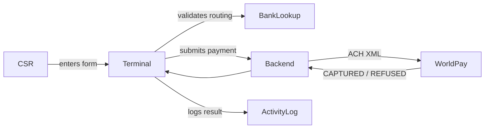

# Unicity Virtual Terminal

## Overview

A CSR-facing web tool for processing one-time ACH bank draft payments on behalf of customers over the phone. The CSR enters customer banking information, reads a scripted authorization to the customer, and submits the payment to WorldPay's WPG XML API.

## Non-goals

- **Not a saved payment method tool** — each transaction is one-time; no cards or accounts are stored.
- **Not a refund or void interface** — post-capture operations are handled outside this app.
- **Not a customer-facing checkout** — designed exclusively for CSR use, not self-service.

## Features

- [Routing Number Validation](#routing-number-validation)
- [ACH Payment Processing](#ach-payment-processing)
- [CSR Authorization Script](#csr-authorization-script)
- [Transaction Activity Log](#transaction-activity-log)

---

### Routing Number Validation

**Purpose**: Confirm a routing number belongs to a real US bank so the CSR can catch entry errors before submitting to WorldPay.

**Behavior**:
1. CSR enters a 9-digit routing number → the app looks up the bank name and auto-fills it, showing the bank name, city, and state as confirmation
2. CSR enters a routing number that doesn't match any US bank → the app warns that the bank couldn't be verified but does not block submission, since WorldPay performs its own validation
3. CSR enters fewer than 9 digits → no lookup is triggered and the bank name field stays empty
4. CSR changes the routing number while a lookup is in progress → the previous lookup is cancelled and a new one starts

**Verify**:
1. **Covers B1**: Enter `021000021` in the routing number field
   - **Page**: `/` (Terminal tab)
   - Wait ~1 second for validation
   - Confirm: "JPMORGAN CHASE BANK, NA" appears below the field in green with a checkmark; Bank Name field auto-fills and becomes read-only

2. **Covers B2**: Enter a 9-digit number not in the Fed database (e.g. `000010101`)
   - **Page**: `/` (Terminal tab)
   - Confirm: Warning shown but no red blocking error; Pay Now can still be enabled by filling remaining fields

3. **Covers B3**: Type `02100002` (8 digits)
   - **Page**: `/` (Terminal tab)
   - Confirm: No API call fires; Bank Name field remains empty

4. **Covers B4**: Type a routing number quickly, then change it before lookup completes
   - **Page**: `/` (Terminal tab)
   - Confirm: Only the final routing number triggers a lookup; no stale bank name appears

---

### ACH Payment Processing

**Purpose**: Submit a customer-authorized ACH bank draft to WorldPay so Unicity can collect payment without requiring a card.

**Behavior**:
1. CSR completes the form and checks the authorization checkbox → Pay Now button becomes active
2. CSR submits a valid payment → WorldPay captures the ACH debit and the app shows a green success screen with the payer name, amount, and order code
3. CSR submits and WorldPay declines for insufficient funds → the app shows a specific message prompting the CSR to collect a different payment method
4. CSR submits and WorldPay declines for an invalid account or routing number → the app shows a message to confirm those details with the customer
5. CSR submits and WorldPay is temporarily unavailable → the app shows a retry message; no duplicate charge occurs because the original order was never processed
6. CSR leaves any required field blank → Pay Now stays disabled and the missing field is visually indicated
7. CSR submits and the transaction is logged → the Activity tab counter increments and the transaction appears at the top of the activity list

**Required fields**: Payer Name, Email, Routing Number (9 digits, validated), Account Number, Account Type, eCheck Type, Amount (> $0), ZIP Code, Check Number, Custom Identifier, Authorization checkbox.

**Verify**:
1. **Covers B1**: Fill all required fields with valid test data, check authorization checkbox
   - **Page**: `/` (Terminal tab)
   - Confirm: Pay Now button is active (full opacity, clickable)

2. **Covers B2**: Submit with routing `021000021`, account `5186005800001012`, amount `14.99`, ZIP `45249`, check number `1104`, custom identifier `6549`
   - **Page**: `/` (Terminal tab)
   - Confirm: Green "Payment Captured" card appears with payer name, `$14.99`, and a generated order code like `ACH-{timestamp}-{random}`
   - **GET**: `/api/health` → `{ status: "ok" }` confirms server is running

3. **Covers B3, B4**: WorldPay test environment will return REFUSED with a decline reason
   - Check Activity tab → transaction appears with amber REFUSED badge and decline message

4. **Covers B5**: Stop the backend server mid-test and submit
   - Confirm: Red banner appears with "Unable to reach payment processor" message; no order code generated

5. **Covers B6**: Leave ZIP Code blank, fill everything else
   - Confirm: Pay Now button remains disabled

6. **Covers B7**: Complete a successful payment
   - Click Activity tab
   - Confirm: New entry at top with green CAPTURED badge, payer name, amount, timestamp

---

### CSR Authorization Script

**Purpose**: Give the CSR exact language to read to the customer before charging so Unicity captures verbal authorization and the customer understands what they are agreeing to.

**Behavior**:
1. CSR opens the Terminal → the right panel shows an order summary and a pre-written script with blank placeholders for unfilled fields
2. CSR fills in form fields → the script updates in real time, replacing placeholders with the entered values (name, amount, bank, account last 4)
3. CSR reads the script and the customer confirms → CSR checks the authorization checkbox, which enables Pay Now
4. Customer declines during the script → CSR does not check the authorization checkbox; Pay Now remains disabled and no charge is submitted

**Verify**:
1. **Covers B1, B2**: Open Terminal, begin filling the form
   - **Page**: `/` (Terminal tab, right panel)
   - Confirm: Order summary rows update as each field is typed; script highlights (bold) update with entered name, amount, bank name, and masked account number

2. **Covers B3**: Check the "Customer authorizes this charge" checkbox after completing the script
   - Confirm: Pay Now button becomes active

3. **Covers B4**: Leave the authorization checkbox unchecked
   - Confirm: Pay Now button stays disabled even when all other fields are complete

---

### Transaction Activity Log

**Purpose**: Give CSRs and supervisors a real-time record of all Pay Now attempts so they can verify transaction outcomes and investigate issues without leaving the app.

**Behavior**:
1. A payment is submitted (successfully or not) → a transaction entry is prepended to the activity list with status, payer, amount, bank details, and timestamp
2. CSR switches to the Activity tab → all transactions from the current browser session and previous sessions are shown, newest first
3. Transaction was captured or authorised → entry displays a green banner with a checkmark
4. Transaction was refused → entry displays an amber banner with the decline reason
5. Transaction errored or was cancelled → entry displays a red or gray banner respectively
6. CSR clicks "Clear log" → all entries are removed from the view and from browser storage
7. Activity tab shows a count badge → the number reflects all stored transactions and updates immediately after each Pay Now attempt

**Verify**:
1. **Covers B1, B2**: Submit a payment and click Activity tab
   - **Page**: `/activity`
   - Confirm: New card at top shows payer name, amount, routing number, masked account, bank, timestamp, and status badge

2. **Covers B3**: After a successful CAPTURED response
   - Confirm: Transaction card has green header, checkmark icon, and "CAPTURED" label

3. **Covers B4**: After a REFUSED response from WorldPay
   - Confirm: Transaction card has amber header with decline message text

4. **Covers B6**: Click "Clear log"
   - Confirm: List empties; "No transactions yet" message appears; nav badge shows 0

5. **Covers B7**: Submit multiple payments without clearing
   - Confirm: Activity tab label shows `Activity (N)` where N matches the number of submitted transactions
